# Vim Code Runner - run your code the same way as with [vs code runner](https://github.com/formulahendry/vscode-code-runner)
https://github.com/user-attachments/assets/63109233-1e5d-4d54-b890-30eb07dab826
- [Vim Code Runner - run your code the same way as with vs code runner](#vim-code-runner---run-your-code-the-same-way-as-with-vs-code-runner)
	- [Requirements](#requirements)
	- [Installation](#installation)
	- [Usage](#usage)
		- [`CodeRunnerRunByFileExt`](#coderunnerrunbyfileext)
		- [`CodeRunnerRunByFileType`](#coderunnerrunbyfiletype)
		- [`CodeRunnerRunByGlob`](#coderunnerrunbyglob)
		- [`CodeRunnerRun`](#coderunnerrun)
		- [`coderunner#Load()`](#coderunnerload)
		- [`coderunner#RemoveCoderunnerTempfiles()`](#coderunnerremovecoderunnertempfiles)
	- [Configuration](#configuration)
		- [`g:coderunner_by_file_ext`](#gcoderunner_by_file_ext)
		- [`g:coderunner_by_file_type`](#gcoderunner_by_file_type)
		- [`g:coderunner_by_glob`](#gcoderunner_by_glob)
		- [`g:coderunner_executor`](#gcoderunner_executor)
		- [`g:coderunner_ignore_selection`](#gcoderunner_ignore_selection)
		- [`g:coderunner_remove_coderunner_tempfiles_on_exit`](#gcoderunner_remove_coderunner_tempfiles_on_exit)
		- [`g:coderunner_respect_shebang`](#gcoderunner_respect_shebang)
		- [`g:coderunner_runners_order`](#gcoderunner_runners_order)
		- [`g:coderunner_save_all_files_before_run`](#gcoderunner_save_all_files_before_run)
		- [`g:coderunner_save_file_before_run`](#gcoderunner_save_file_before_run)
		- [`g:coderunner_tempfile_prefix`](#gcoderunner_tempfile_prefix)
	- [Interpolated variables](#interpolated-variables)
	- [For developers](#for-developers)
		- [Setup environment](#setup-environment)
		- [Plugin architecture](#plugin-architecture)

## Requirements
- Vim version 8.0+ with Python3 support. Check with:
    ```vim
    :echo has('python3') " should return 1
    ```
- To use `CodeRunnerRunByGlob` python version must be above 3.13. Check with:
   ```vim
   :py3 import sys;print(sys.version) " should return >= 3.13
   ```

## Installation
Install the Vim plugin with your favorite plugin manager, e.g. vim-plug:
```vim  
Plug 'ZaharChernenko/vim-code-runner'  
```

## Usage
### `CodeRunnerRunByFileExt`
Tries to execute the code if the extension of the current file matches the extension from [`g:coderunner_by_file_ext`](#gcoderunner_by_file_ext), the extension is a dot + the last part of the file name after the last dot.
### `CodeRunnerRunByFileType`
Tries to execute the code if the current file type is defined in the [`g:coderunner_by_file_type`](#gcoderunner_by_file_type), to find out what type of open file run `:echo &filetype`.
### `CodeRunnerRunByGlob`
Tries to execute the code if the full path of the current file corresponds to some glob pattern in [`g:coderunner_by_glob`](#gcoderunner_by_glob), **it is important that this function works only with vim, which has version python3.13+.**
### `CodeRunnerRun`
Tries to execute the code using the fallback strategy defined in [`g:coderunner_runners_order`](#gcoderunner_runners_order).
### `coderunner#Load()`
The function that loads the coderunner module also updates the variables: g:coderunner_by_file_ext, g:coderunner_by_file_type g:coderunner_by_glob.
### `coderunner#RemoveCoderunnerTempfiles()`
The function that cleans up temporary files that were created due to run with selection, it clears only those files that were created in the current vim session.

## Configuration
### `g:coderunner_by_file_ext`
Hash table with mapping of file extensions to commands, default `{}`, example:
```vim
let g:coderunner_by_file_ext = {
    \ '.cpp': 'bash -c "cd \"$dir\" && g++ -o cpp_output -std=c++2a *.cpp && ./cpp_output"',
    \ '.py': 'bash -c "cd \"$dir\" && python3 \"$fullFileName\""',
\ }
```
### `g:coderunner_by_file_type`
Hash table with mapping of file types to commands, default `{}`, example:
```vim
let g:coderunner_by_file_type = {
    \ 'cpp': 'bash -c "cd \"$dir\" && g++ -o cpp_output -std=c++2a *.cpp && ./cpp_output"',
    \ 'python': 'bash -c "cd \"$dir\" && python3 \"$fullFileName\""',
\ }
```
To find out what type of open file run `:echo &filetype`.
### `g:coderunner_by_glob`
Hash table with mapping glob patterns into commands, given that the hash table is unordered, coderunner sorts the patterns in reverse lexicographic order, trying to find the most accurate one first, default `{}`, example:
```vim
let g:coderunner_by_glob = {
    \ '**/*.cpp': 'bash -c "cd \"$dir\" && g++ -o cpp_output -std=c++2a *.cpp && ./cpp_output"',
    \ '**/*.py': 'bash -c "cd \"$dir\" && python3 \"$fullFileName\""',
\ } 
```
### `g:coderunner_executor`
Any vim command that can execute a string is suitable, default `ter`, default behaviour:

https://github.com/user-attachments/assets/bea987a0-7269-4dc4-ae01-590a71d9dd5f

It is important to note that a regular terminal does not execute commands related through logical operators, for example `&&`, so you need to use `bash -c` with a string.

But for example, if you have [floaterm](https://github.com/voldikss/vim-floaterm) plugin installed, you can set the following command:
```vim
let g:coderunner_executor = "FloatermNew --autoclose=0"
```

https://github.com/user-attachments/assets/374e11d4-efd8-42ae-bdce-92b5df0cdb39
### `g:coderunner_ignore_selection`
If 1 ranges do not work, the command is executed for the entire file, default `0`.
### `g:coderunner_remove_coderunner_tempfiles_on_exit`
If 1, then when exiting the vim, it calls the [coderunner#RemoveCoderunnerTempfiles()](#coderunnerremovecoderunnertempfiles) command, default `0`.
### `g:coderunner_respect_shebang`
if 1, the shebang command is executed, even if there are matches in the hash tables, default `1`.
### `g:coderunner_runners_order`
Defines the order of searching for matches when executing the [CodeRunnerRun](#coderunnerrun) command, default `['by_glob', 'by_file_ext', 'by_file_type']`.
### `g:coderunner_save_all_files_before_run`
If 1, saves all open files before execution, note files are saved only if a runner is found, default `0`.
### `g:coderunner_save_file_before_run`
If 1, saves the current file before execution, default `0`.
### `g:coderunner_tempfile_prefix`
The prefix with which files will be saved in the directory of the executable file when executing commands with selection.

## Interpolated variables
Some string sequences starting with $ will be replaced, here is a list of them:
- $workspaceRoot - `getcwd()`
- $fullFileName
- $fileNameWithoutExt
- $fileName
- $fileExt
- $driveLetter
- $dirWithoutTrailingSlash
- $dir

Example of the work can be viewed in the [tests](https://github.com/ZaharChernenko/vim-code-runner/blob/main/python_coderunner/tests/unit/command_builder/test_interpolator_command_builder.py).

## For developers
### Setup environment
```shell
cd python_coderunner
uv sync
source .venv/bin/activate
pre-commit install
```
### Plugin architecture

```mermaid
classDiagram
TCodeRunner "1" o--> "1" IConfigManager : aggregates
TCodeRunner "1" o--> "1" ICommandsExecutor : aggregates
TCodeRunner "1" o--> "1" IMessagePrinter : aggregates
TCodeRunner "1" o--> "1" TBasicEditorServiceForCodeRunner : aggregates
TCodeRunner "1" o--> "1" TBasicCommandDispatcherStrategySelector : aggregates
IConfigManager "1" o--> "1" IConfigGetter : aggregates
IConfigManager "1" o--> "1" TBasicConfigValidator : aggregates
TBasicEditorServiceForCodeRunner "1" o--> "1" IEditor : aggregates
TBasicEditorServiceForCodeRunner "1" o--> "1" IConfigManager : aggregates
ICommandsExecutor "1" o--> "1" IConfigManager : aggregates
TBasicCommandDispatcherStrategySelector "1" o--> "1" TShebangCommandBuildersDispatcher : aggregates
TBasicCommandDispatcherStrategySelector "1" o--> "1" TGlobCommandBuildersDispatcher : aggregates
TBasicCommandDispatcherStrategySelector "1" o--> "1" TFileExtCommandBuildersDispatcher : aggregates
TBasicCommandDispatcherStrategySelector "1" o--> "1" TFileTypeCommandBuildersDispatcher : aggregates
TBasicCommandDispatcherStrategySelector "1" o--> "1" IConfigManager : aggregates
TShebangCommandBuildersDispatcher ..|> ICommandBuildersDispatcher : implements
TShebangCommandBuildersDispatcher "1" o--> "1" IFileInfoExtractor : aggregates
TGlobCommandBuildersDispatcher ..|> ICommandBuildersDispatcher : implements
TFileExtCommandBuildersDispatcher ..|> ICommandBuildersDispatcher : implements
TFileExtCommandBuildersDispatcher "1" o--> "1" IFileInfoExtractor : aggregates
TFileTypeCommandBuildersDispatcher ..|> ICommandBuildersDispatcher : implements
TFileTypeCommandBuildersDispatcher "1" o--> "1" IFileInfoExtractor : aggregates
ICommandBuildersDispatcher ..> ICommandBuilder : returns
TInterpolatorCommandBuilder ..|> ICommandBuilder : implements
TInterpolatorCommandBuilder "1" o--> "1" IProjectInfoExtractor : aggregates
TInterpolatorCommandBuilder "1" o--> "1" IFileInfoExtractor : aggregates
IProjectInfoExtractor "1" o--> "1" IFileInfoExtractor : aggregates


class TCodeRunner {
	# config_manager: IConfigManager
	# editor_service: TBasicEditorServiceForCodeRunner
	# command_dispatcher_strategy_selector: TBasicCommandDispatcherStrategySelector
	# commands_executor: ICommandsExecutor
	# message_printer: IMessagePrinter
	+ run() None
	+ run_by_glob() None
	+ run_by_file_ext() None
	+ run_by_file_type() None
	+ remove_coderunner_tempfiles() None
	+ on_exit() None
}



class IConfigManager {
	<<interface>>
	+ get_dispatchers_order() list[str]
	+ get_executor() str
	+ get_ignore_selection() bool
	+ get_respect_shebang() bool
	+ get_save_all_files() bool
	+ get_save_file() bool
}


class IConfigGetter {
	<<interface>>
	+ get_dispatchers_order() Any
	+ get_executor() Any
	+ get_ignore_selection() Any
	+ get_respect_shebang() Any
	+ get_save_all_files() Any
	+ get_save_file() Any
}


class TBasicConfigValidator {
	+ validate_bool() bool
	+ validate_str() str
	+ validate_dispatcher() Dict[str, str]
	+ validate_dispatchers_order() List[EDispatchersTypes]
}


class TBasicEditorServiceForCodeRunner {
	# editor: IEditor
	# config_manager: IConfigManager
	// creates context which will delete file if it's temporary
	+ get_file_for_run() Context[str]
	// runs save_file or save_all_files if the command_builder is found,
	// and vars in config are True
	+ prepare_for_run() None
	+ remove_coderunner_tempfiles() None
}


class IEditor {
	<<interface>>
	+ get_current_file_name() str
	+ get_selected_text() Optional[str]
	+ save_all_files() None
	+ save_file() None
}


class ICommandsExecutor {
	<<interface>>
	Сlass for executing a string command only.
	+ execute(command: str) None
}


class IMessagePrinter {
	+ info(text: str) None
	+ error(text: str) None
}


class TBasicCommandDispatcherStrategySelector {
	# config_manager: IConfigManager
	# shebang_dispatcher: TShebangCommandBuildersDispatcher
	# file_type_dispatcher: TFileExtCommandBuildersDispatcher
	# file_ext_dispatcher: TFileTypeCommandBuildersDispatcher
	# file_glob_dispatcher: ICommandBuildersDispatcher
	+ dispatch_by_file_type(file_path_abs: str) Optional[ICommandBuilder]
	+ dispatch_by_file_ext(file_path_abs: str) Optional[ICommandBuilder]
	+ dispatch_by_glob(file_path_abs: str) Optional[ICommandBuilder]
	+ dispatch_by_shebang(file_path_abs: str) Optional[TShebangCommandBuilder]
	+ dispatch(file_path_abs: str) Optional[ICommandBuilder] 
}


class TShebangCommandBuildersDispatcher {
	# file_info_extractor: IFileInfoExtractor
	+ dispatch(file_path_abs: str) Optional[TShebangCommandBuilder]
}


class TGlobCommandBuildersDispatcher {
	# file_info_extractor: IFileInfoExtractor
	+ dispatch(file_path_abs: str) Optional[ICommandBuilder]
}


class TFileExtCommandBuildersDispatcher {
	# file_info_extractor: IFileInfoExtractor
	+ dispatch(file_path_abs: str) Optional[ICommandBuilder]
}


class TFileTypeCommandBuildersDispatcher {
	# file_info_extractor: IFileInfoExtractor
	+ dispatch(file_path_abs: str) Optional[ICommandBuilder]
}


class ICommandBuildersDispatcher {
	<<interface>>
	Dispatch is optional for fallback strategy
	+ dispatch(file_path_abs: str) Optional[ICommandBuilder]
}


class TInterpolatorCommandBuilder {
	# template_string: str
	# file_info_extractor: IFileInfoExtractor
	+ TInterpolatorCommandBuilder(template_string: str, file_info_extractor: IFileInfoExtractor)
	+ build(file_path_abs: str) str
	# interpolate(file_path_abs: str) str
}


class ICommandBuilder {
	<<interface>>
	Build requires absolute file path, because file can be temporary, like
	file which was generated by run selected.
	+ build(file_path_abs: str) str
}


class IProjectInfoExtractor {
	<<interface>>
	# file_info_extractor: IFileInfoExtractor
	+ get_workspace_root() str
	if the workspace is large, then it may be worth doing the operation in another thread
	or asynchronous, which, however, will not give an increase in speed, but perhaps
	vim will not lag at this moment
	+ get_all_files_filter_by_exts(exts: set[str]) Iterable[str]
	+ get_all_files_filter_by_file_type(file_types: set[str]) Iterable[str]
}


class IFileInfoExtractor {
	<<interface>>
	Declares all commands that are directly connected to the file.
	Accepts only file absolute path.
	+ get_dir(file_path_abs: str) str
	+ get_dir_without_trailing_slash(file_path_abs: str) str
	+ get_file_name(file_path_abs: str) str
	+ get_file_name_without_ext(file_path_abs: str) str
	+ get_file_ext(file_path_abs: str) str
	+ get_file_type(file_path_abs: str) Optional[str]
	+ get_drive_letter(file_path_abs: str) str
	+ get_shebang(file_path_abs: str) Optional[str]
}
```
